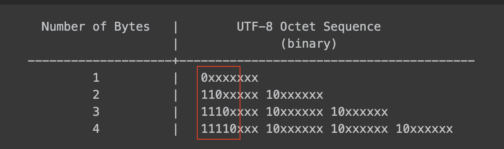

### Logic

1. count the number of 1 with the byte (prefex). It starts from the beginning of the list

  ```
   e.g [197,130,1] sequence: 11000101 10000010 00000001
   
   First operation starts from 197.
   197 has two "1" prefixes. So, the number of bytes is two, such that 197 and 130 are each set as 2 bytes. We’ll consider the following bytes as other bytes.
  ``` 

2. Check if the beginning of byte conforms to the rule of bytes.
  
  
  ```
   e.g 
   
   197 -> 11000101
   140 -> 10001100

   condition:
    case1: The prefix of the staring byte can not be 1   
          -> there's no combination that is '10' 
    case2: The number of '1' must be less than 5 ( n <= 4)
          -> Sequence is 1 to 4 bytes long.
  ```
 
2. Check if each byte conforms to the rule of bytes.

  ```
  e.g. [197,130,1] sequence: 11000101 10000010 00000001

  197 and 130 are set as 2 bytes. Going by the problem description, 
  2 bytes must be described as 110xxxxx 10xxxxxx
  we know 197 is 110xxxxx, and it's valid because it's a starting byte. We have to validate 130 by checking if 130 comforms to 10 as prefix

  In this example, 130 is valid, then The set of 197, 130 are valid.

  2 bytes are complete and ready to be checked. we start over checking other bytes from 1

  1 is 00000001, and it's 1 byte. This means 1 itself is valid
  
  There's no following byte, and all bytes are valid. This input is a valid byte.
  ```

3. If all bytes are valid, return true, otherwise false
